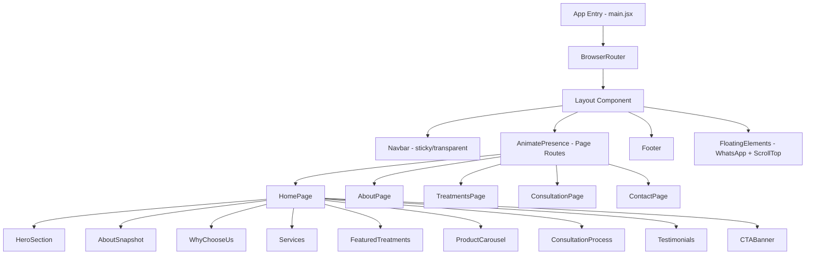
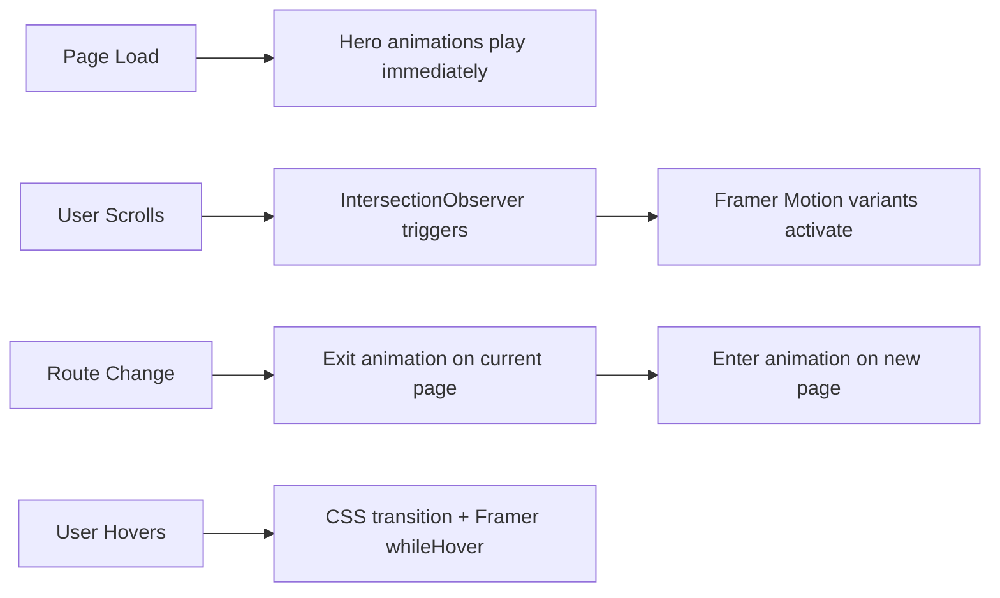

# Design Document: Aanvee Homoeo Stores & Clinic Website

## Overview

This design describes a premium, responsive static website for "Aanvee Homoeo Stores & Clinic" — a homeopathy store and clinic. The website is built as a single-page application (SPA) using React with client-side routing, styled with Tailwind CSS, and enhanced with Framer Motion animations and a glassmorphism design system.

The site consists of 5 pages (Home, About Us, Treatments, Consultation, Contact Us) connected via React Router. It uses a basil green color palette with cream/white backgrounds, frosted glass card effects, and smooth scroll-triggered animations to create a premium wellness brand experience.

**Key Technical Decisions:**
- **React + Vite**: Fast build tooling with HMR for development, optimized production builds
- **Tailwind CSS v3**: Utility-first styling with custom design tokens for the basil green palette and glassmorphism effects
- **Framer Motion**: Declarative animation library for scroll reveals, page transitions, and hover effects
- **React Router v6**: Client-side routing with AnimatePresence for smooth page transitions
- **Static deployment**: No backend — form submissions handled via third-party service (e.g., Formspree, EmailJS) or WhatsApp redirect

## Architecture



### Routing Structure

| Route | Page Component | Description |
|-------|---------------|-------------|
| `/` | HomePage | Landing page with all informational sections |
| `/about` | AboutPage | Clinic story, mission, team profiles |
| `/treatments` | TreatmentsPage | Disease-specific treatment cards |
| `/consultation` | ConsultationPage | Booking form and consultation info |
| `/contact` | ContactPage | Contact details, map, and form |

### Animation Strategy



## Components and Interfaces

### Component Directory Structure

```
src/
├── components/
│   ├── layout/
│   │   ├── Navbar.jsx          # Sticky nav with scroll detection
│   │   ├── Footer.jsx          # Global footer
│   │   ├── Layout.jsx          # Page wrapper with nav + footer
│   │   ├── Breadcrumb.jsx      # Breadcrumb navigation
│   │   └── MobileMenu.jsx      # Full-screen mobile nav overlay
│   ├── ui/
│   │   ├── GlassCard.jsx       # Reusable glassmorphism card
│   │   ├── CTAButton.jsx       # Gradient call-to-action button
│   │   ├── SectionReveal.jsx   # Scroll-triggered animation wrapper
│   │   ├── FloatingWhatsApp.jsx# Floating WhatsApp button
│   │   ├── ScrollToTop.jsx     # Scroll-to-top button
│   │   ├── StickyBookButton.jsx# Mobile sticky CTA
│   │   ├── Timeline.jsx        # Step-by-step timeline component
│   │   ├── Carousel.jsx        # Product carousel slider
│   │   └── FAQAccordion.jsx    # Expandable FAQ items
│   └── sections/
│       ├── home/
│       │   ├── HeroSection.jsx
│       │   ├── AboutSnapshot.jsx
│       │   ├── WhyChooseUs.jsx
│       │   ├── Services.jsx
│       │   ├── FeaturedTreatments.jsx
│       │   ├── ProductShowcase.jsx
│       │   ├── ConsultationProcess.jsx
│       │   ├── Testimonials.jsx
│       │   └── CTABanner.jsx
│       ├── about/
│       │   ├── ClinicStory.jsx
│       │   ├── MissionVision.jsx
│       │   ├── DoctorProfiles.jsx
│       │   └── ClinicTimeline.jsx
│       ├── treatments/
│       │   └── TreatmentCard.jsx
│       ├── consultation/
│       │   ├── AppointmentForm.jsx
│       │   ├── ConsultationBenefits.jsx
│       │   └── DoctorAvailability.jsx
│       └── contact/
│           ├── ContactForm.jsx
│           ├── MapEmbed.jsx
│           └── BusinessInfo.jsx
├── pages/
│   ├── HomePage.jsx
│   ├── AboutPage.jsx
│   ├── TreatmentsPage.jsx
│   ├── ConsultationPage.jsx
│   └── ContactPage.jsx
├── data/
│   ├── treatments.js           # Treatment card data
│   ├── services.js             # Services list data
│   ├── testimonials.js         # Testimonial content
│   └── navigation.js           # Nav links and routes
├── hooks/
│   ├── useScrollPosition.js    # Track scroll for navbar
│   └── useInView.js            # Intersection observer hook
├── utils/
│   ├── validation.js           # Form validation logic
│   └── constants.js            # Design tokens, contact info
├── App.jsx
└── main.jsx
```

### Key Component Interfaces

#### Navbar

```jsx
// Props: none (uses internal scroll state)
// State: isScrolled (boolean), isMobileMenuOpen (boolean)
// Behavior: 
//   - Transparent when scroll < 50px, solid white when >= 50px
//   - Shows hamburger menu on mobile (<768px)
//   - Contains "Book Consultation" CTA linking to /consultation
```

#### GlassCard

```jsx
// Props:
//   children: ReactNode
//   className?: string (additional Tailwind classes)
//   hover?: boolean (enable hover animation, default true)
// Renders: div with backdrop-blur, bg-white/10, border, rounded-xl, shadow
```

#### SectionReveal

```jsx
// Props:
//   children: ReactNode
//   direction?: 'up' | 'left' | 'right' | 'fade' (default 'up')
//   delay?: number (seconds, default 0)
//   className?: string
// Behavior: Uses Framer Motion + IntersectionObserver
//   - Triggers once when element enters viewport
//   - Applies fade + translate animation
```

#### TreatmentCard

```jsx
// Props:
//   treatment: { id, name, icon, overview, symptoms[], benefits[], medicines[], slug }
//   isExpanded: boolean
//   onToggle: () => void
// Renders: 
//   - Collapsed: icon, name, brief overview
//   - Expanded: full details with symptoms, benefits, medicines, CTA button
```

#### AppointmentForm

```jsx
// Props: none
// State: formData, errors, isSubmitting, isSuccess
// Fields: fullName, mobile, email, age, gender, healthConcern, 
//         preferredDate, preferredTime, consultationType, message
// Validation: Client-side with inline error messages
// Submit: POST to form service or WhatsApp redirect
```

#### Validation Utility (utils/validation.js)

```jsx
// validateField(fieldName: string, value: string, rules: object) => string | null
//   Returns error message or null if valid
//
// validateForm(formData: object, validationRules: object) => { isValid: boolean, errors: object }
//   Returns validation result with error messages for each invalid field
//
// Rules:
//   - required: field must not be empty/whitespace-only
//   - minLength: minimum character count
//   - pattern: regex match (email, phone)
//   - custom: custom validator function
```

## Data Models

### Treatment Data

```javascript
// data/treatments.js
const treatment = {
  id: "migraine",
  name: "Migraine",
  icon: "🧠",                    // or icon component reference
  overview: "Brief description of the condition...",
  symptoms: ["Throbbing headache", "Nausea", "Light sensitivity"],
  benefits: ["No side effects", "Treats root cause", "Long-term relief"],
  medicines: ["Belladonna", "Natrum Muriaticum", "Spigelia"],
  slug: "migraine"
};
```

### Form Data

```javascript
// Appointment form state shape
const formData = {
  fullName: "",          // required, min 2 chars
  mobile: "",            // required, 10-digit pattern
  email: "",             // required, email pattern
  age: "",               // required, numeric 1-120
  gender: "",            // required, select: Male/Female/Other
  healthConcern: "",     // required, min 10 chars
  preferredDate: "",     // required, future date
  preferredTime: "",     // required, select from available slots
  consultationType: "",  // required, select: online/offline
  message: ""            // optional, max 500 chars
};

// Validation errors shape
const errors = {
  fullName: "Full name is required",
  mobile: null,  // null = no error
  email: "Please enter a valid email address",
  // ...
};
```

### Navigation Data

```javascript
// data/navigation.js
const navLinks = [
  { label: "Home", path: "/", exact: true },
  { label: "About Us", path: "/about" },
  { label: "Treatments", path: "/treatments" },
  { label: "Consultation", path: "/consultation" },
  { label: "Contact Us", path: "/contact" }
];

const breadcrumbMap = {
  "/about": [{ label: "Home", path: "/" }, { label: "About Us" }],
  "/treatments": [{ label: "Home", path: "/" }, { label: "Treatments" }],
  "/consultation": [{ label: "Home", path: "/" }, { label: "Consultation" }],
  "/contact": [{ label: "Home", path: "/" }, { label: "Contact Us" }]
};
```

### Design Tokens

```javascript
// utils/constants.js or tailwind.config.js extend
const designTokens = {
  colors: {
    primary: "#5F8D4E",        // Basil green
    primaryLight: "#7BAF6B",   // Lighter green
    primaryDark: "#4A7039",    // Darker green
    sage: "#A8C69F",           // Soft sage
    cream: "#FDF8F0",          // Cream background
    gold: "#D4A853",           // Light gold accent
    white: "#FFFFFF",
    dark: "#2D3436"            // Text dark
  },
  glassmorphism: {
    background: "rgba(255, 255, 255, 0.15)",
    backdropBlur: "blur(12px)",
    border: "1px solid rgba(255, 255, 255, 0.2)",
    borderRadius: "16px",
    shadow: "0 8px 32px rgba(95, 141, 78, 0.1)"
  },
  animation: {
    sectionRevealDuration: 0.6,
    hoverTransition: 0.15,
    pageTransitionDuration: 0.3,
    staggerDelay: 0.1
  }
};
```

## Correctness Properties

*A property is a characteristic or behavior that should hold true across all valid executions of a system — essentially, a formal statement about what the system should do. Properties serve as the bridge between human-readable specifications and machine-verifiable correctness guarantees.*

### Property 1: Form validation rejects empty required fields

*For any* subset of required form fields left empty (or containing only whitespace), submitting the appointment form should produce validation error messages for exactly those empty fields, and the form should not be submitted.

**Validates: Requirements 7.3**

### Property 2: Expanded treatment cards display all required information

*For any* valid treatment data object, when rendered in the expanded state, the component output should contain the disease overview, symptoms list, benefits of homeopathy, common medicines, and a "Book Consultation" call-to-action.

**Validates: Requirements 6.2**

### Property 3: Global UI elements present on all pages

*For any* page route in the application, the rendered page should contain a footer with clinic details, contact information, social media icons, navigation links, working hours, and copyright notice, as well as a floating WhatsApp button.

**Validates: Requirements 9.1, 11.1**

### Property 4: SEO meta tags present on all pages

*For any* page route in the application, the document head should contain a title tag, meta description, and Open Graph tags (og:title, og:description) with non-empty values specific to that page.

**Validates: Requirements 13.3**

### Property 5: Mobile interactive elements meet minimum tap target size

*For any* interactive element (button, link, form input) rendered at a mobile viewport width (< 768px), the element's computed clickable area should be at least 44px × 44px.

**Validates: Requirements 1.2**

## Error Handling

### Form Validation Errors

| Error Scenario | Handling |
|---------------|----------|
| Empty required field | Inline error message below field, field border turns red |
| Invalid email format | "Please enter a valid email address" |
| Invalid phone format | "Please enter a valid 10-digit mobile number" |
| Age out of range | "Please enter a valid age (1-120)" |
| Past date selected | "Please select a future date" |
| Health concern too short | "Please describe your concern in at least 10 characters" |

- Validation runs on blur (per-field) and on submit (all fields)
- Error messages are cleared when the user corrects the field
- Form does not submit until all required fields pass validation
- No page reload on validation failure

### Navigation Errors

- Invalid routes display a 404-style "Page Not Found" component with a link back to Home
- Broken anchor links gracefully do nothing (no crash)

### Animation Fallbacks

- If Framer Motion fails to load, content renders without animation (progressive enhancement)
- Reduced motion preference (`prefers-reduced-motion: reduce`) disables all animations
- Heavy animations are lazy-loaded to avoid blocking initial render

### Image Loading

- All images use lazy loading with placeholder/skeleton states
- Broken image URLs show a styled fallback placeholder
- WebP format with JPEG fallback for browser compatibility

## Testing Strategy

### Unit Tests (Vitest + React Testing Library)

Focus on component rendering and interaction logic:

- **Navbar**: Renders all links, scroll behavior toggles background, hamburger menu opens/closes
- **AppointmentForm**: Field rendering, validation error display, successful submission flow
- **TreatmentCard**: Collapsed/expanded states, content visibility
- **Breadcrumb**: Correct path rendering per route
- **GlassCard**: Renders children, applies glassmorphism classes
- **FloatingWhatsApp**: Renders on all pages, correct href
- **ScrollToTop**: Appears after 300px scroll, scrolls to top on click

### Property-Based Tests (fast-check + Vitest)

Property-based testing is applicable for the form validation logic and component data rendering:

- **Property 1**: Generate random subsets of required fields as empty → verify validation catches exactly those fields
- **Property 2**: Generate random valid treatment objects → verify expanded card contains all required fields
- **Property 3**: Iterate all routes → verify footer and WhatsApp button presence
- **Property 4**: Iterate all routes → verify meta tags presence
- **Property 5**: Render at mobile viewport → verify all interactive elements ≥ 44px tap target

**Configuration:**
- Minimum 100 iterations per property test
- Tag format: `Feature: aanvee-homoeo-website, Property {N}: {description}`
- Library: `fast-check` with Vitest test runner

### Integration Tests

- Full page rendering at key breakpoints (320px, 768px, 1024px, 1440px)
- Route navigation flow (click link → page transition → correct content)
- Form submission end-to-end flow (fill → validate → submit → success)

### Visual Regression Tests (optional)

- Snapshot tests for key components at each breakpoint
- Storybook stories for isolated component development

### Accessibility Testing

- axe-core integration for automated a11y checks
- Keyboard navigation verification
- Screen reader landmark verification (semantic HTML)
- Color contrast ratio validation (WCAG AA minimum)

### Performance Testing

- Lighthouse CI for automated performance scoring
- Bundle size monitoring (< 200KB initial JS)
- Animation frame rate profiling on throttled CPU
